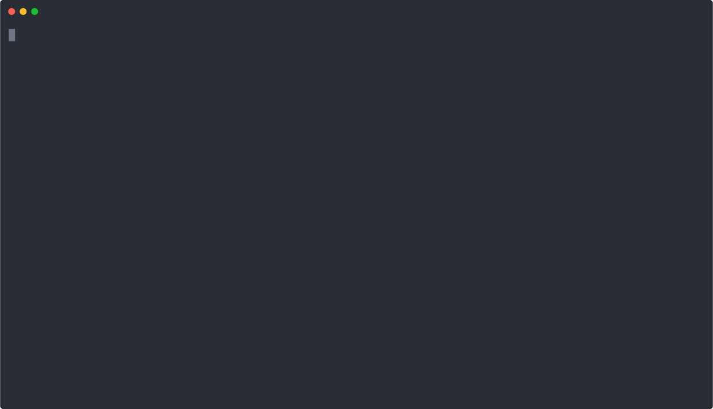

# @synth1s/cloak

[](https://github.com/synth1s/cloak/actions/workflows/ci.yml)
[](https://www.npmjs.com/package/@synth1s/cloak)
[](https://www.npmjs.com/package/@synth1s/cloak)
[](LICENSE)

**Stop logging out. Start switching.**

Every developer wears a different cloak. One for work, one for personal projects, one for that freelance gig. **Cloak** lets you dress your Claude Code in the right identity — and switch between them without breaking a sweat.

No file swapping. No token juggling. Each account is a fully isolated directory — safe for concurrent sessions across terminals. [195+ developers asked for this.](https://github.com/anthropics/claude-code/issues/18435)



## Before / After

**Before Cloak:**
```
claude → /logout → /login (lose session) → work on project
claude → /logout → /login (lose session) → personal use
```

**After Cloak:**
```
claude -a work     # instant. sessions preserved.
claude -a home     # in another terminal. at the same time.
```

## Install

```bash
npm install -g @synth1s/cloak
```

## 3 steps to get started

```bash
# 1. Save your current Claude session
cloak create work

# 2. Log out, log in with another account in Claude, then:
cloak create home

# 3. Set up shell integration
cloak switch work    # follows the guided setup on first run
```

That's it. From now on:

```bash
claude -a work       # switch and launch
claude -a home       # in another terminal, at the same time
```

## Commands

| Command | Description |
|---------|-------------|
| `cloak create [name]` | Save current session as a new cloak |
| `cloak switch <name>` | Wear a different cloak |
| `cloak list` | See all cloaks in your wardrobe |
| `cloak whoami` | Which cloak are you wearing? |
| `cloak delete <name>` | Discard a cloak |
| `cloak rename <old> <new>` | Rename a cloak |
| `cloak bind <name>` | Bind this directory to a cloak |
| `cloak unbind` | Remove directory binding |
| `cloak sync [name]` | Sync credentials from macOS Keychain into a profile |
| `cloak sessions [name]` | List sessions for a profile, newest first |
| `cloak resume <session-id>` | Resume a previous Claude session |

With shell integration (`eval "$(cloak init)"`):

| Command | Description |
|---------|-------------|
| `claude -a <name>` | Switch and launch Claude |
| `claude account <cmd>` | All cloak commands via claude |
| `cloak resume <session-id>` | Set identity + launch `claude --resume` in one step |

## Concurrent sessions

Different terminal, different identity. No conflicts.

```bash
# Terminal A:
claude -a work

# Terminal B (at the same time):
claude -a home
```

Each account is a completely isolated directory. No file overlap, no token conflicts.

## Auto-switch by directory

Bind a cloak to a project directory. Claude automatically uses the right account.

```bash
cd ~/projects/company
cloak bind work

cd ~/projects/personal
cloak bind home
```

From now on, `claude` in those directories uses the bound account — no manual switch needed.

## macOS Keychain sync

On macOS, Claude Code stores OAuth tokens in the Keychain. `cloak sync` reads them from there and writes them into the active profile — so you can keep using the Keychain as your source of truth without manual file copying.

```bash
# First time: store the credential JSON in the Keychain
security add-generic-password \
  -s "Claude Code-credentials-work" \
  -a "$USER" \
  -w "$(cat ~/.claude/.credentials.json)"

# On every subsequent run, refresh the profile from the Keychain
cloak sync work
```

Each profile has its own Keychain slot: `Claude Code-credentials-<name>`.

## Session resume

Pick up any previous conversation where you left off.

```bash
# List sessions for the active profile
cloak sessions

# Resume one (shell integration handles CLAUDE_CONFIG_DIR + claude --resume)
cloak resume <session-id>

# Resume a session from a specific profile
cloak resume <session-id> --profile work
```

## Context bar

Every command shows which identity is active:

```
cloak > list . work <filipe@company.com> ────────────────────────────

Your Cloaks

  > work (active) — filipe@company.com
    home — filipe@personal.com
```

## Why Cloak

- **No file swapping** — each account is its own directory, not a copy of shared files
- **Concurrent sessions** — different terminals, different accounts, at the same time
- **Auto-switch by directory** — bind a project to a cloak, forget about it
- **One command** — `claude -a work` switches and launches in one step
- **Nothing is lost** — tokens, MCP servers, settings, all preserved per account
- **Secure** — credentials stored with restrictive permissions (0o600), never transmitted

## How it works

Cloak uses Claude Code's official [`CLAUDE_CONFIG_DIR`](https://code.claude.com/docs/en/env-vars) environment variable. Each account gets its own directory:

```
~/.cloak/
└── profiles/
    ├── work/                # complete, isolated config
    │   ├── .claude.json
    │   ├── .credentials.json   # synced from Keychain via cloak sync
    │   ├── settings.json
    │   └── projects/           # session history per project
    │       └── -myproject/
    │           ├── sessions-index.json
    │           └── <session-id>.jsonl
    └── home/
        ├── .claude.json
        └── ...
```

Switching changes which directory Claude Code reads from. Nothing is copied, moved, or overwritten.

## FAQ

<details>
<summary><strong>Will switching overwrite my settings?</strong></summary>

No. Each account is a completely isolated directory. Switching only changes which directory Claude Code reads from. Your settings, MCP servers, and preferences for each account stay exactly where they are.
</details>

<details>
<summary><strong>Are token renewals preserved?</strong></summary>

Yes. When Claude Code renews your OAuth token during a session, it writes to the active account's directory. When you switch away and back, the renewed token is still there.
</details>

<details>
<summary><strong>Can I lose data with multiple accounts running?</strong></summary>

No, as long as each terminal uses a different account. Each has its own directory — no file overlap.
</details>

<details>
<summary><strong>Is my auth token safe?</strong></summary>

Cloak never transmits, logs, or modifies your tokens. It only copies files during `cloak create` and changes an environment variable during `cloak switch`. All data stays local. Credential files are created with restrictive permissions (0o600).

`cloak sync` reads from your local macOS Keychain only — no network calls are made. The token is written to the profile directory with `0o600` permissions atomically (no race window between write and chmod).
</details>

<details>
<summary><strong>What if I uninstall Cloak?</strong></summary>

Your account directories remain in `~/.cloak/`. Claude Code works normally with its default config. To clean up: `rm -rf ~/.cloak`
</details>

<details>
<summary><strong>Does it work with IDE extensions?</strong></summary>

IDE extensions may not respect `CLAUDE_CONFIG_DIR` ([known limitation](https://github.com/anthropics/claude-code/issues/4739)). Cloak is designed for terminal-based Claude Code.
</details>

## Requirements

- Node.js >= 18
- bash or zsh (for shell integration)
- macOS (for `cloak sync` — Keychain integration is macOS-only)

## Contributing

See [CONTRIBUTING.md](CONTRIBUTING.md).

## Security

See [SECURITY.md](SECURITY.md).

## Documentation

- [Requirements & use cases](docs/requirements.md)
- [Technical specification](docs/technical-spec.md)

## License

MIT
